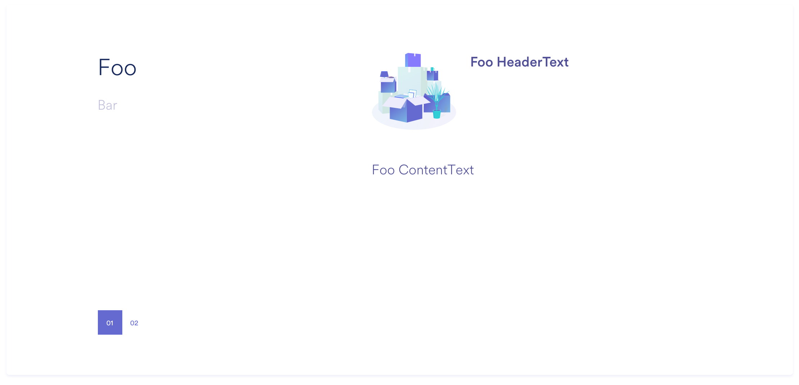
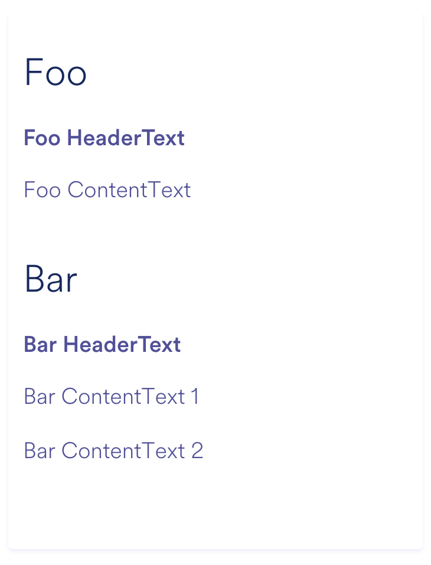

# content-splitter

`<content-splitter>` is a text presentation component developed in Vue composed by a menu, a pager and a content area including a header with or without an image and a content text. It sets a fixed height in order to present large contents in a small area.
It has two versions, a desktop version available for widths larger than 800px that allows selection of one of each existing items, and a mobile version presenting all items stacked in a single column.





```html
<content-splitter></content-splitter>

<!-- default properties -->
<meta charset="utf-8">
<title>content-splitter demo</title>
<script src="https://unpkg.com/vue"></script>
<!-- Imports polyfill -->
<script src="https://unpkg.com/@webcomponents/webcomponentsjs@2.0.0/webcomponents-loader.js"></script>
<script src="./content-splitter.js"></script>

<content-splitter id="anySelector"></content-splitter>

<script>
  document.querySelector('anySelector').items = [{
    'id': 1,
    'title': 'Any title',
    'headerText': 'Any header text.',
    'headerImg': '',
    'headerPreloadImg': '',
    'contentText': 'Any large text.'
  }]
</script>
```

## Installation

```bash
bower install -save therapychat-feeling-better
```

## License

content-splitter is available under the `Apache License 2.0`. See the [LICENSE](./LICENSE) file for more info.

## Changelog

See [CHANGELOG](./CHANGELOG.md) file.

